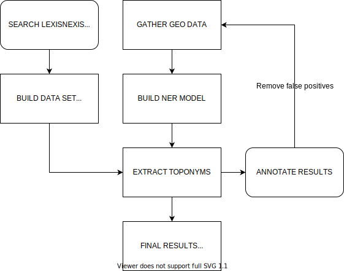

# Toponym extraction

This repo contains:
1. [Tools](#tools) for extracting toponyms (and lemma's) from newspaper articles downloaded from LexisNexis.
2. The [results](#results) that were collected with these tools for a research on toponyms in news on Brexit in Dutch newspapers.
3. A short write up on this [case study](https://lcvriend.github.io/toponym_extraction/). Check out the interactive map [here](https://lcvriend.github.io/toponym_extraction/map_toponyms.html).

## Workflow

## Tools
There are three main scripts that were used to generate the data for this case study. Each script contains further documentation on how they should be used:
- [Create a spaCy NER-model for extracting toponyms](scripts/01_create_model.py)
- [Extract text and meta data from LexisNexis files](scripts/02_textraction.py)
- [Apply the model to the data set and extract statistics from it](scripts/03_spacify)

## Results
This tool currently extracts two main statistics:
1. Total frequency
2. Article counts
