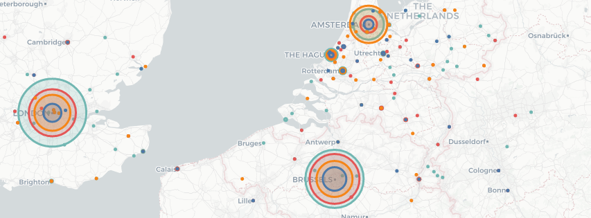
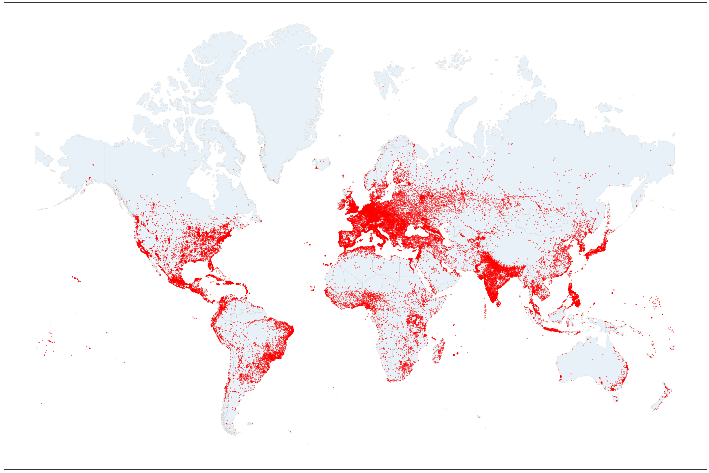

# What places do Dutch newspapers cover when talking about Brexit?
**Toponym Extraction Case Study:**  
*Using named entity recognition to extract geographical information from newspapers*

This case study shows an example of the kind of analysis that can be done when using *named entity recognition* to annotate texts with geographical entitities. The code and scripts that were used in this analysis can be found in the [GitHub repo](https://github.com/lcvriend/toponym_extraction).

## Idea

> “The press, as we now know it, has grown and evolved rapidly over the last 200 years (particularly since 1850), generating an ever-growing flood of geographical information.” (Harvey, 2005, p.230)

Newspapers inform us about what is happening in the world. In this sense they are conveying to us geographical information. One tool we have at our disposal for reasoning about our world are [toponyms](https://en.wikipedia.org/wiki/Toponymy), i.e. place names. This raises the question how much newspapers refer to places through toponyms.

Let's try to find that out by analyzing Dutch newspaper coverage on Brexit.

## Articles

To start we select all articles in 2017 containing at least one mention of the phrase 'Brexit' in four Dutch newspapers:

* Two 'quality' newspapers:
    * [De Volkskrant](https://www.volkskrant.nl/)
    * [Trouw](https://www.trouw.nl/)
* One 'popular' newspaper:
    * [De Telegraaf](https://www.telegraaf.nl/)
* One regional newspaper:
    * [De Leeuwarder Courant](https://www.lc.nl/)

In total 1,830 articles were found meeting these criteria. The articles that were used in this case study can be found [here](https://github.com/lcvriend/lexisnexis_place_extraction/blob/master/data/lexisnexis_dataset.csv). The content itself is copyrighted, so unfortunately the dataset contains only metadata and not the actual articles themselves. Check out these [word clouds](lemma_clouds.md) though to see which lemma's are most prevalent in the respective newspapers. The Brexit has been in the news throughout in these four news papers:

#### Number of articles containing the term 'Brexit' per month in 2017

## Geodata

Now we need to get hold of list toponyms that we can use in the *named entity recognition*. Two freely available resources that we can use for this purpose are the [GeoNames](http://www.geonames.org/) and [REST Countries](http://restcountries.eu/) datasets. The map below shows all data points that were selected from the GeoNames dataset for the task at hand. The dataset contains 45,300 toponyms in total.

#### Place distribution in the GeoNames dataset

## Toponyms

Using `spaCy's` [named entitiy recognition functionality](https://spacy.io/usage/linguistic-features#named-entities) we can then collect and count all toponyms in the newspaper articles. Perhaps unsurprisingly only a fraction of the total toponyms are recognized:

Toponyms         | REST/GeoNames | Found in dataset | % Found 
-----------------|--------------:|-----------------:|---------:
Countries        |           268 |              151 |    56.3 
Cities Friesland |            27 |               11 |    40.7 
Cities NL        |           474 |              119 |    25.1 
Cities UK        |         1,532 |              147 |     9.6 
Cities world     |        43,237 |              844 |     2.0 

The interactive graphs below shows several measures for the found results. Click on the legend labels to zoom in on a specific newspaper. Select multiple newspapers by shift-clicking.

#### Some measures on the occurrence of toponyms in the selected articles

The analysis also tells us specifically *what* places were mentioned in the articles. By plotting that information on a map we can see the geographical distribution of news on Brexit. Explore the results in [this interactive map](map_toponyms.html). The circle sizes represent the number of times a toponym was found in the dataset. With the layer control you can switch on/off layers. Click on a circle to open a tooltip with more information on the toponym and the frequency with which it occurs in the text and articles.

## Insights

Some insights that can be gleaned from this analysis are:

1. The quality newspapers contain a greater volume of toponyms.
2. They also refer to a greater number of different places.
3. The coverage is heavily biased towards London, Brussels and Amsterdam.
4. The regional newspaper covers the north of NL, the other papers do not. 

## References
*Harvey, D. (2005). "The sociological and geographical imaginations". In: International Journal of Politics, Culture, and Society 18.3-4, p. 211–255.*
