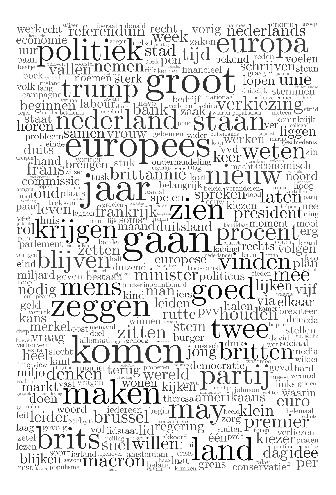
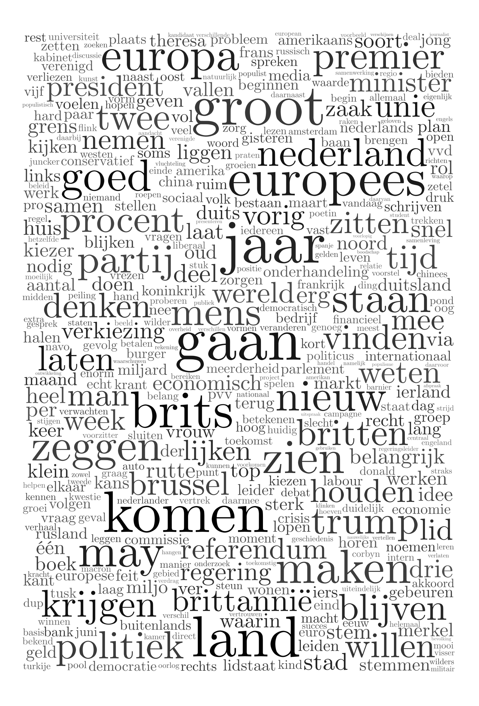
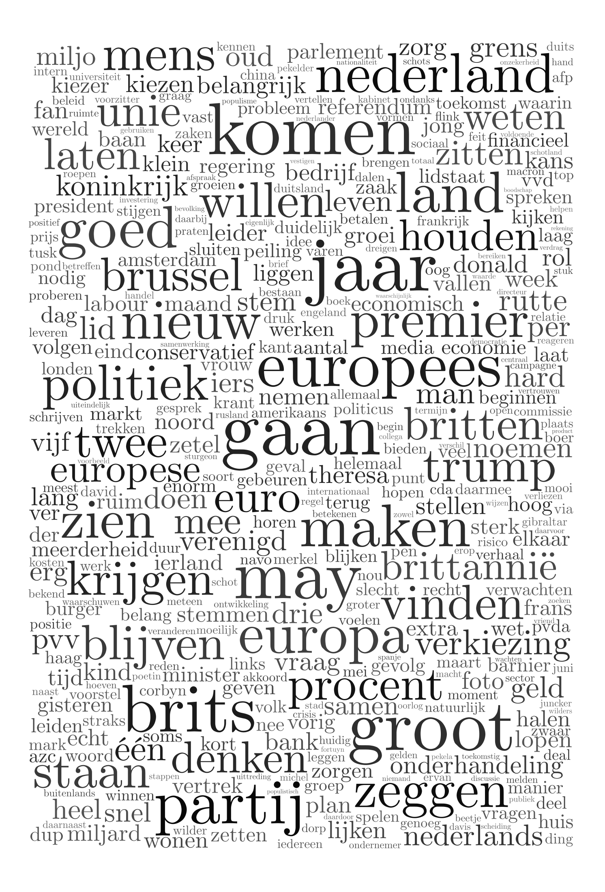

# Lemma clouds
The text from the articles was also [lemmatized](https://spacy.io/api/lemmatizer) using `spaCy`. These lemma's were counted and then turned into the following word clouds: 

## Volkskrant

## Trouw

## Telegraaf

## Leeuwarder Courant

